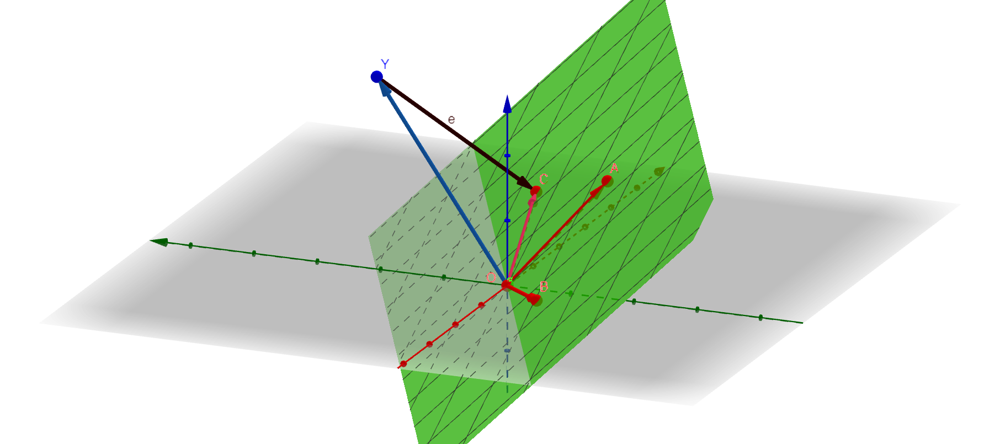

# Project_2_Numerical_PSI

# Algorithm for Least Square Fit

**Goal:** Given a target function $f\_{\*}(x)$ we want to make a approximate $p$-degree polynomial 

```math
f(x) = \sum_{i=0}^p{b_i x^i}.
```
Next we evaluate $(x\_{(1)},x\_{(2)},\cdots,x\_{(n)})$, $n\geq p$ points are beinge evaluated for both $f(x)$ and $f_{\*}(x)$, so that the $RMS$ error got minimized 

```math
\hat{e} = \sqrt{\sum_{i=0}^{n}\frac{\left(f(x_{(i)})-f_{*}(x_{(i)})\right)^2}{n}}.
```

Lets define 
```math
\bar{b} = \left(\begin{matrix}b_0\\ b_1\\ \vdots\\ b_p \end{matrix}\right), \bar{y} = \left(\begin{matrix}f_*(x_{(0)})\\ f_*(x_{(1)})\\ \vdots \\ f_*(x_{(n)})\end{matrix}\right)
```
,and 

```math
\bar{A} = \left(\begin{matrix} 1 & x_{(1)} & \cdots & x^{p}_{(1)} \\ 1 & x_{(2)} & \cdots & x^{p}_{(2)}\\ \\ \vdots & \ddots & \ddots & \vdots\\ 1 & x_{(n)} & \cdots & x^{p}_{(n)} \end{matrix} \right).
```

We can rephrase the problem in maxtrix format like, 

$$ \bar{A} \bar{b} = \bar{y}$$

where $\bar{b}$ contains the coefficient of fitting polynomial $f(x)$. 

This can be represented into geometric language. We can say the best fitting can be achieved, if we can find the best approximation of $\bar{y}$ into the column space of $\bar{A}$ matrix. Pictorially, we represent the column space of $\bar{A}$ spanned by $\vec{OA}$ and $\vec{OB}$ vectors in the following picture and $\bar{y}$ vector by $\vec{OY}$. The best approximation we can find for $\vec{OY}$ with in column space of $\bar{A}$ by projecting $\vec{OY}$ over the hyperspace spanned by $\vec{OA}$ and $\vec{OB}$. Because the "error" vector $\vec{OY}-\vec{OC} = \vec{YC} = {e}$ would have the minimum length ( $L^2$ or Euclidean norm) if we project $\vec{OY}$ over the hyperspace. We identify that the previously mentioned $RMS$ error $\hat{e}=\frac{|{e}|}{\sqrt{n}}$.



If we want to project some $n$ dimensional vector $\vec{u}$ over the hyperspace if we act $\bar{A}^T$ (transpose matrix of $\bar{A}$) on the $\vec{u}$. Because we know that $\bar{A}$ can be represented as ,

$$ \bar{A} = \sum_{i=1}^{n}\sum_{j=0}^{p}|e_{i} \rangle\langle f_{j}|$$

where $\{|f_{i} \rangle\}$ and $\{|e_{i} \rangle\}$ span the $p+1$ and $n$-dimesional vector space. Therefore, $\bar{A}^T \bar{u}$ would live in the ${p}+1$ dimensional vector subspace. Hence, we can find the projected equation in $p+1$-dimensional vector space would be,

$$ \bar{A}^{T} \bar{A} \bar{b} = \bar{A}^T \bar{y}$$

By solving this system of equation we can find the projected vector $\vec{OC}$ in the $p+1$ dimensional vector space with basis vectors $|f_{i} \rangle, i=0, \cdots, p$. 

## Key functions contained in it 
- `RMS_error_calculator` function calculates RMS error $\hat{e}$ for some target function and an polynomial with `pmax` order. 
    
    Inputs: 
    
    * target_function: a function 𝑓star(𝑥) that is need to be approximated
    * args           : the required arguments to evalue the target_function
    * pmax           : the order of the approximated polynomial f(x)
    
    Returns:
    
    RMS error = √(Σ(f(x)- 𝑓star(𝑥))^2/n)
    
    Usage: 
    
    ```
    # target function is sin(x)
    xx = LinRange(0, π/2, 100)
    error = RMS_error_calculator(sin, xx, 10)
    
    ```
- `RMS_error_calculator_anti` function calculates RMS error $\hat{e}$ for some target function and an *antisymmetric* polynomial with $2$ `pm` $ +1$ order. 
    
    Inputs:
    
    * target_function: a function 𝑓star(𝑥) that is need to be approximated
    * args           : the required arguments to evalue the target_function
    * pm             : the order of the approximated polynomial f(x)
    
    Returns RMS error = √(Σ(f(x)- 𝑓star(𝑥))^2/n)
    
    Usage: 
    
    ```
    # target antisymmetric function is sin(x)
    xx = LinRange(0, π/2, 100)
    error = RMS_error_calculator_anti(sin, xx, 10)
    
    ```
## Usage

All the problem descriptions and solutions are explained and plotted inside the ipython notebook. Anyone could run all the cells and see the output. Moreover, an HTML and a PDF version have been provided to show the results produced on the author's own computer for comparison. The picture in the algorithm part has been generated by geogebra file provided in the directory. 
